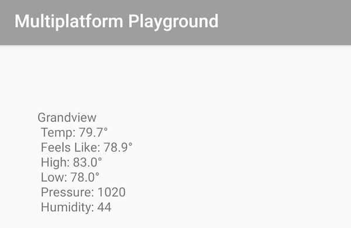
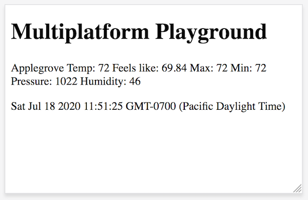
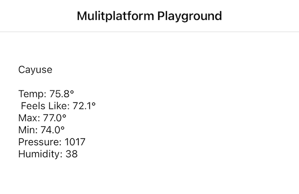

# Kotlin Multiplatform Playground Template
This project is for experimenting with Kotlin Multiplatform

| Android       | Web           | iOS           | 
| ------------- | ------------- | ------------- |
|   |    |    |

## Dependencies
 - [Kotlin Coroutines](https://kotlinlang.org/docs/reference/coroutines-overview.html)
 - [Kotlin Ktor](https://ktor.io/clients/index.html)
 - [Kotlin Serialization](https://github.com/Kotlin/kotlinx.serialization)
 - [Kotlin React](https://github.com/JetBrains/kotlin-wrappers/blob/master/kotlin-react/README.md)
 - [SQLDelight](https://cashapp.github.io/sqldelight/)
 - [Open Weather Map](https://openweathermap.org/)

 ## Open Weather Map
 To access the OpenWeatherMap API you need an [API Key](http://openweathermap.org/appid).

 ### Common Lib
 The common library needs access to your api key to interact with the Open Weather Map API. Create a **gradle.properties** file in the root of the **common** module with a string value pair representing your API Key.  This file is not tracked in Git as it is for personal use.

 ```groovy
 OPENWEATHER_API_KEY = "YOUR-API-KEY"
 ```

## Blog Series
 - [Getting Started](https://gh.jdoneill.com/2019/12/07/kotlin-mulitplatform/)
 - [Multiplatform Persistence with SQLDelight](https://gh.jdoneill.com/2020/06/29/sqldelight/)

## Contributors
<a href="https://github.com/doneill/kotlin-multiplatform-template/graphs/contributors">
  
</a>

## Licensing
A copy of the license is available in the repository's [LICENSE](LICENSE) file.
